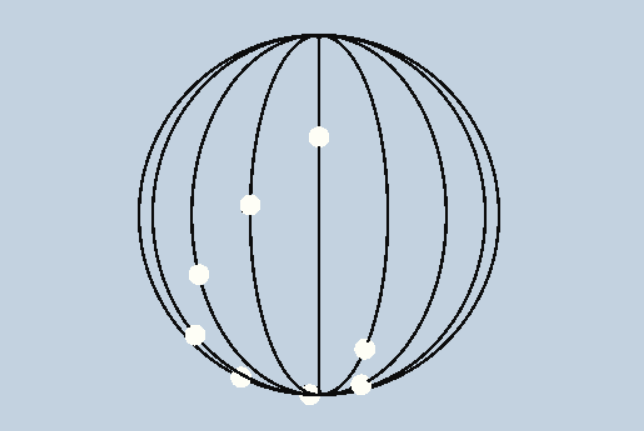
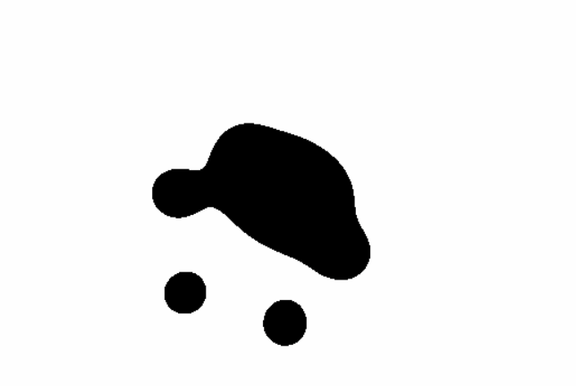
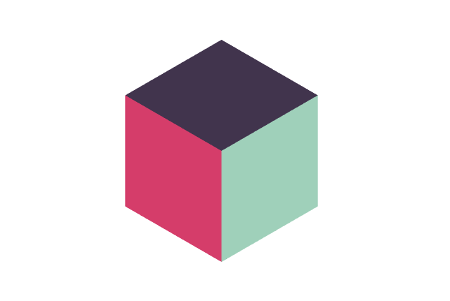
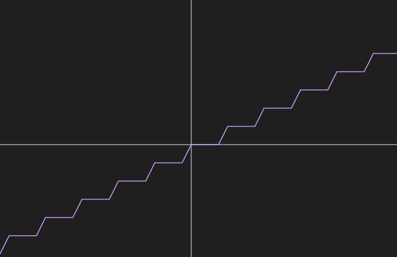

# Case-study CIS 566

## Overview

In this assignment, I completed three of the intermediate examples, they are spindle of death, paw metaballs and tri-color cube. Spindle of death and paw metaballs are implemented in shadertoy, while tri-color cube is implemented in my own webgl project.

Below are the results of my implementation:
* Spindle of Death: [Link](https://www.shadertoy.com/view/Xstyz8)

|**My Implementation**|**Example**|
|---|---|
|||

* Paw Metaballs: [Link](https://www.shadertoy.com/view/XddyzH)

|**My Implementation**|**Example**|
|---|---|
|||

* Tri-color Cube: [Link](https://jiaww.github.io/Funny-Shaders/)

|**My Implementation**|**Example**|
|---|---|
|||

## Implementation Details
* Spindle of Death: 
  * This one is really simple, it's only a combination of many **spheres** rotating on a **torus**, and each sphere rotates with a *phase difference*. When the balls are rotating, also rotate the camera, you can get the disired animation like examples. 
  * I used rectangular projection **Ray-Marching** to create the scene.
  * Also used this following function to control the time value, it can make a pause on each disired camera direction.
    
    |`float dt = max(0.0, fract(iTime*0.5)*4.0-3.0) + floor(iTime*0.5);`|
    |---|
    ||
    
    
    
* Paw Metaballs:
  * This is a 2D-version metaball animation, and after analysis it's also a combination of many very simple motions: just 8 black 2d-metaballs move outside and inside with a phase difference and diffrent directions.
  * The realization of the metaball is also pretty easy, just use unsigned-distance function to describe each metaball, and for each pixel in the scene, compute the sum of all 8 distances, if the sum is larger than a threshold, set the color black, otherwise, set it white.
  
  

* Tri-color Cube:
  * After analysis, this is also a combination of motions, there are 4 phases:
    * Rotate Color Anticlockwise 
    * Rotate Cube by its x-axis Anticlockwise
    * Rotate Color Clockwise
    * Rotate Cube by its y-axis Clockwise
  * Here I used Rasterizer to realize it, because the colors of the cube's faces are different and they are rotate with the cube, it's really hard to realize it using Ray-Marching.
  * I seperate the motions into 2 groups: Rotate Color and Rotate Cube
    * Rotate Cube is easy to implement, just set a rotation matrix to rotate the cube in 3D place
    * Rotate Color is a little bit tricky: (You can look the how the trick done by uncheck the trick trigger)
      * Firstly, create a mask which is a hexagon with the same size of the cube in pixel space, and we only render what inside of this area.
      * Secondly, scale the cube double to make it's rotation can cover all area of the hexagon.
      * Then, rotate the cube by its diagonal, which can make it like only rotate the color because we only render what inside of the hexgon.
      * Finally, scale the cube to its original size for the following rotate cube motion.
      
  

